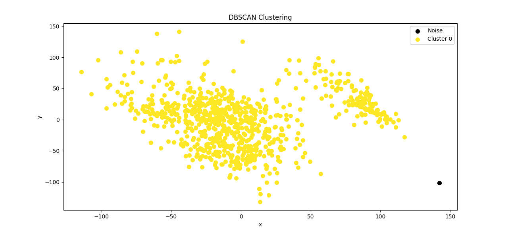
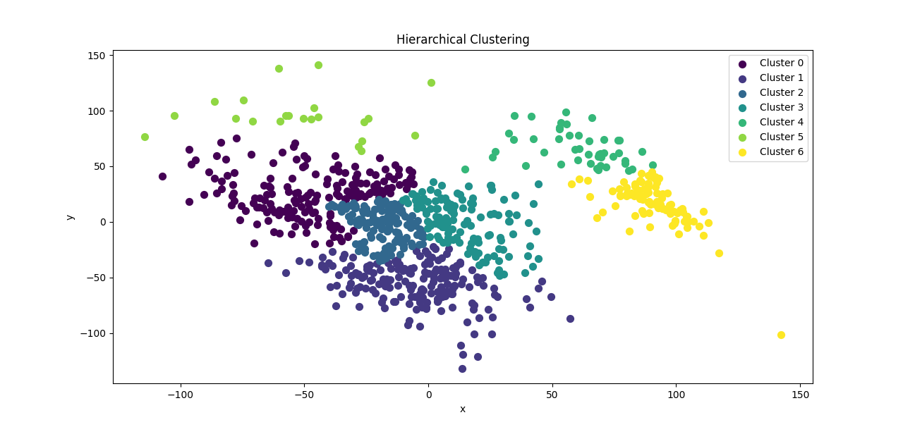
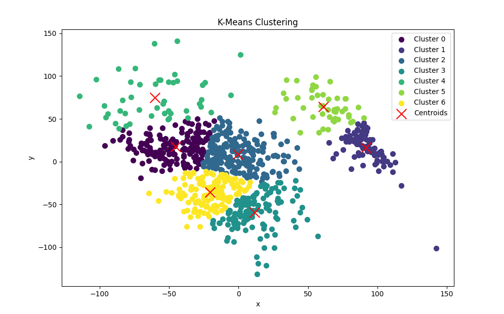
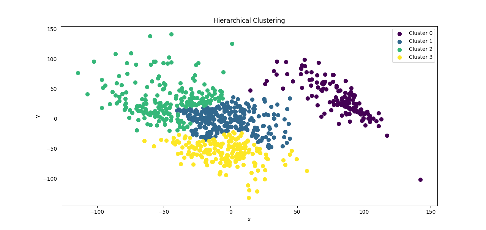
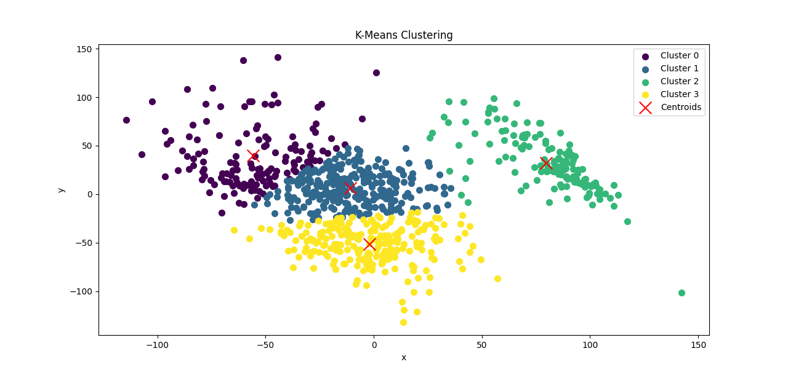

# AT3_Mineracao

Objetivo do database:

Contextualizar o uso dos três modelos de Clustering: K-means, Hierárquico e DBSCAN, efazer uma comparação com os resultados alcançados. Link: https://archive.ics.uci.edu/dataset/401/gene+expression+cancer+rna+seq

Contextualização dos dados:

Para essa atividade, será utilizada uma base de dados da UC Irvine contendo dados depacientes com câncer. A coleção de dados é uma parte da sequência RNA (Hi-Seq) PANCAN, elarepresenta uma extração aleatória de expressões genéticas de pacientes tendo 5 diferentes tipos detumor, BRCA, KIRC, COAD, LUAD e PREAD.O DataFrame possui dados de 801 pacientes, cada valor representando a quantidade do genepresente no RNA do paciente.

Atividades:

1)Pré-processamento: verificar se há valores faltantes; normalizar os dados para torná-losequiparáveis entre si; aplicar alguma técnica de redução de dimensionalidade (como oPCA);

2)Aplicar os três modelos de clustering;

3)Responder aos questionamentos: quantos clusters cada modelo gerou? Quais foram oscentroids? Imprima os gráficos e faça uma comparação dos resultados gerados em cadamodelo.

### Resultados Clusterização:
## DBSCAN

## Hierarchical com 7 Clusters

## KMEANS com 7 Clusters

## Hierarchical com 4 Clusters

## KMEANS com 4 Clusters

